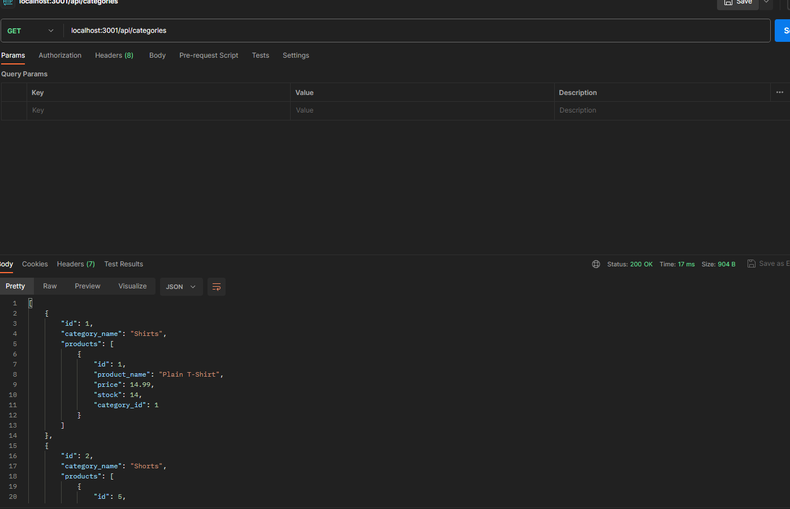

# 13 Object-Relational Mapping (ORM): E-Commerce Back End
## Description
Internet retail, also known as **e-commerce**, is the largest sector of the electronics industry, generating an estimated $29 trillion in 2019. E-commerce platforms like Shopify and WooCommerce provide a suite of services to businesses of all sizes. Due to their prevalence, understanding the fundamental architecture of these platforms will benefit you as a full-stack web developer.
The task of this project was to build the back end for an e-commerce site by modifying starter code, configuring a working Express.js API to use Sequelize to interact with a MySQL database.
# Table Of Contents
- [13 Object-Relational Mapping (ORM): E-Commerce Back End](#13-object-relational-mapping-orm-e-commerce-back-end)
  - [Description](#description)
- [Table Of Contents](#table-of-contents)
  - [Installation](#installation)
  - [Usage](#usage)
  - [User Story](#user-story)
  - [Acceptance Criteria](#acceptance-criteria)
  - [Demo](#demo)
  - [Screenshot](#screenshot)
  - [Liscense](#liscense)
  - [Contribution](#contribution)
  - [Questions](#questions)

## Installation

CLone this repository and open in a code editor such as VS Code or the like. In your terminal of the root folder, install dependencies using 'npm i' . Log into your MySequel using 'mysql -u root -p'. Enter your password. The credentials will be stored in a .env file that you will put in your gitignore package to keep your information safe. Start your database by entering 'source db/schema' then log off of MySql using 'quit'. Run seed data with 'npm run seed' then start your server using 'node server.js' . 

## Usage
After completing the installation steps, open a database such as Postman, Insomnia, or similar. In the address bar after creating a new http request in your workspace, type localhost:3001/api/categories, localhost:3001/api/products, or localhost:3001/api/tags. You will use GET to retrieve all database items in these categories. You use GET again and type in a product, category, or tag id after the address (example: localhost:3001/api/products/1) to get one item. Add, edit, or delete using POST, PUT, or DELETE appropriately. 
## User Story
```md
AS A manager at an internet retail company
I WANT a back end for my e-commerce website that uses the latest technologies
SO THAT my company can compete with other e-commerce companies
```
## Acceptance Criteria
```md
GIVEN a functional Express.js API
WHEN I add my database name, MySQL username, and MySQL password to an environment variable file
THEN I am able to connect to a database using Sequelize
WHEN I enter schema and seed commands
THEN a development database is created and is seeded with test data
WHEN I enter the command to invoke the application
THEN my server is started and the Sequelize models are synced to the MySQL database
WHEN I open API GET routes in Insomnia for categories, products, or tags
THEN the data for each of these routes is displayed in a formatted JSON
WHEN I test API POST, PUT, and DELETE routes in Insomnia
THEN I am able to successfully create, update, and delete data in my database
```
## Demo

Watch how it works [here](https://watch.screencastify.com/v/s1ZGfGaWHO3f5X693WGU)

## Screenshot
 



## Liscense
MIT
https://opensource.org/license/mit/

## Contribution
Please submit a pull request 

## Questions

reach out: [github](https://github.com/sararosebud)